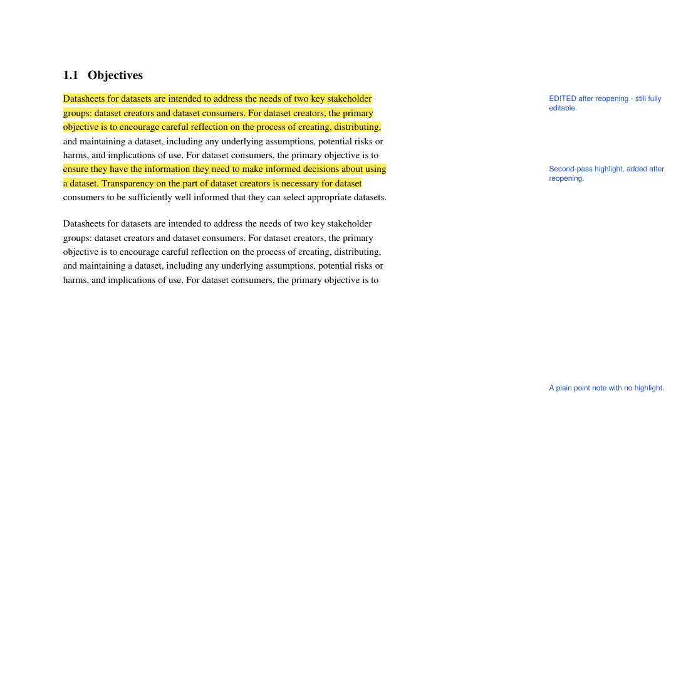

# PDF Voice Notes

Read a PDF, highlight a sentence, and **say what you think** instead of typing it.
Your note appears in the page margin, and saves into the PDF itself.



- **Talk, don't type.** Select a sentence and start speaking — the words land in a
  note beside it.
- **Notes you can actually see.** They print into a margin column, not behind a
  hover-icon you have to hunt for.
- **The PDF is the save file.** Reopen it here next week and every note and
  highlight comes back, still editable. One annotated PDF per reading.
- **Nothing leaves your computer.** No account, no API key, no upload, no cost.

---

## Quick start

### 1. Install Node.js — once

Download the **LTS** version from **[nodejs.org](https://nodejs.org)** and run the
installer, accepting the defaults. It's free and takes about two minutes.

To check it worked, open a terminal (**PowerShell** on Windows, **Terminal** on Mac)
and run:

```bash
node --version
```

If you see something like `v22.14.0`, you're set. If you see "command not found",
close the terminal, open a new one, and try again.

> **Why is this needed?** Only to run a tiny local web server. Browsers refuse to
> give a web page the microphone unless it's served from `https://` or
> `http://localhost` — opening the file directly does nothing. See
> [Why a server?](#why-a-server) below.

### 2. Get the files

On the GitHub page, click the green **Code** button → **Download ZIP**, then unzip it
somewhere you'll find again, like your Desktop.

Or, if you use git:

```bash
git clone https://github.com/mackthom/voice-notes-pdf.git
```

### 3. Start it

**Windows** — open the folder and double-click **`start.cmd`**.

**Mac or Linux** — open Terminal, then:

```bash
cd ~/Desktop/voice-notes-pdf && ./start.sh
```

Either way a terminal window opens and your browser goes to
**http://localhost:8777**.

**Leave that terminal window open while you work** — closing it stops the app.
Press <kbd>Ctrl</kbd>+<kbd>C</kbd> in it when you're done.

If your browser doesn't open on its own, go to <http://localhost:8777> yourself.

### 4. Allow the microphone

The first time you press a microphone button, your browser asks for permission.
**Click Allow**, and choose "every visit" so it stops asking.

**Use Microsoft Edge or Google Chrome.** They're the browsers with a built-in speech
engine. The app still works in Firefox and Safari, but you'll have to type.

---

## Using it

1. **Open PDF…** — or drag a PDF onto the page. There's a `test.pdf` in the folder
   if you just want to try it.
2. **Select the sentence** you're reacting to. It highlights in yellow and a note
   opens in the margin beside it.
   No particular sentence in mind? Click **+ Add note** (or press <kbd>N</kbd>) and
   click anywhere on the page.
3. **Start talking.** Dictation begins on its own. Grey italic text is what the
   engine is still deciding on; it firms up as you go. Press the microphone again
   to stop.
4. **Save annotated PDF…** and pick where it goes.

Highlighted something by mistake? The **×** on the note removes both. Want a
highlight with no comment? Just leave the note empty.

The white sheet on screen — page plus margin column — is the exact shape the saved
page will be, so what you see is what you get.

### Speaking punctuation

With **Voice punctuation** ticked, these spoken words turn into symbols:

`period` · `comma` · `question mark` · `exclamation mark` · `colon` · `semicolon` ·
`dash` · `new line` · `new paragraph`

So *"the author overstates this comma especially in chapter four period new paragraph
worth revisiting"* comes out properly punctuated across two paragraphs. Untick the box
if you actually need to write the word "period".

### Options in the toolbar

| Control | What it does |
| --- | --- |
| **Notes as → Margin text** | Default. Widens each annotated page and prints your notes in the new column, level with the paragraph. Always visible, and prints. |
| **Notes as → Sticky notes** | Leaves page size alone. Each note becomes a standard PDF comment icon you click to read. |
| **Notes as → Both** | Margin text *and* a clickable comment. |
| **Summary pages** | Appends a plain list of every note with its page number to the end of the PDF — handy for revision. |
| **Language** | Which language you're dictating in. |

---

## Where your notes live

**Inside the PDF.** Each save writes them twice: as the highlights and margin text
any PDF reader displays, and as hidden data only this app reads. Reopening that file
here restores everything, fully editable.

So the routine is: open it, talk, save. Come back next week, open the **same saved
file**, and carry on. Re-saving never duplicates notes or widens the page twice.

Two ways to save:

- **Save annotated PDF…** asks where to put it. That new file then becomes the one
  you're editing, so you can keep talking and save again.
- **Overwrite original** replaces the file you opened. It only appears if you opened
  the file with the **Open PDF…** button — that's what gives the browser permission
  to write back; drag-and-drop doesn't. It asks you to confirm.

Notes also autosave to your browser as you talk, but that's only a crash net for the
current session. The copy that lasts is the one in the file — so save before you
close.

---

## Troubleshooting

**Nothing happens when I talk.** Check you're in Edge or Chrome, that you clicked
Allow on the microphone prompt, and that the mic button has turned red. To un-block
it: click the padlock in the address bar → Permissions → Microphone → Allow → reload.

**"node is not recognized" / "command not found".** Node.js isn't installed, or the
terminal was already open before you installed it. Close it, open a new one, try
again.

**The page won't load.** Make sure the terminal window is still open. If it printed
an error about the port being in use, something else has 8777 — start it on a
different one:

```bash
PORT=8899 node serve.mjs
```

On Windows PowerShell: `$env:PORT=8899; node serve.mjs`. Then use
`http://localhost:8899`.

**I can't highlight anything.** Highlighting needs real, selectable text. A scanned
page that's just a photograph has none until it's been run through OCR. Point notes
(**+ Add note**) still work on those.

**My notes vanished.** Reopen the *saved* PDF, not the original — the notes live in
the file you saved.

---

## Limits worth knowing

- Dictation uses your browser's speech engine, which sends **audio** to Microsoft's
  or Google's speech service. That's how the browser feature works. Your **PDF**
  never leaves your machine.
- Firefox and Safari have no built-in speech recognition — typing still works.
- Because selecting text is what creates a highlight, selecting a line just to copy
  it leaves one behind. The **×** clears it.
- **Margin text mode changes the page width** (adds 170pt). That's deliberate: it
  guarantees notes never cover the text. Use *Sticky notes* to keep original page
  dimensions.
- Printed margin text uses a Latin-1 font, so smart quotes become plain ones and
  non-Western characters print as `?`. The editable copy inside the file keeps full
  Unicode — nothing you dictate is lost, only its printed form is simplified.
- Notes anchor to a position on a page, not to the words themselves.
- Editing a note in another PDF reader changes what that reader shows, but not the
  data this app reads — so edit notes here.

---

<a name="why-a-server"></a>

## Why a server?

Browsers only hand out the microphone to a "secure context": `https://` or
`http://localhost`. Double-clicking `index.html` gives you `file://`, where dictation
silently does nothing.

`serve.mjs` exists only to satisfy that rule. It's about 40 lines of Node with no
dependencies, it serves this one folder to your own machine, and it accepts no
connections from anywhere else. Host these files on any HTTPS address instead and you
don't need it at all — the app is entirely client-side.

## How it works

| Piece | Job |
| --- | --- |
| pdf.js (`vendor/`) | Draws the pages and builds the invisible text layer that makes highlighting possible. Pages render lazily, so a 400-page book opens instantly |
| Web Speech API | Dictation. Restarts itself when the engine times out on a pause, so long thoughts aren't cut off |
| pdf-lib (`vendor/`) | Widens each annotated page, writes highlights and margin text as annotations, and embeds the note data in the document |
| `serve.mjs` | The local server described above |

Everything this tool draws goes in as *annotations* carrying a private tag, never as
page content — content, once drawn, can't be taken back out. On save it deletes every
tagged annotation and regenerates them from the embedded data. That's what makes
reopening, editing and re-saving the same file lossless, and why a page is widened
only once no matter how often you save.

Note positions are stored as fractions of the content area, and all layout is computed
in "visual space" — the page as you see it, with rotation already applied — then
converted back to PDF coordinates at the last moment. That's why notes stay anchored
to the right sentence across saves, and read upright even on a sideways-scanned page.

Both libraries are committed in `vendor/`, so the app works with no internet
connection and pulls nothing from a CDN at runtime.
